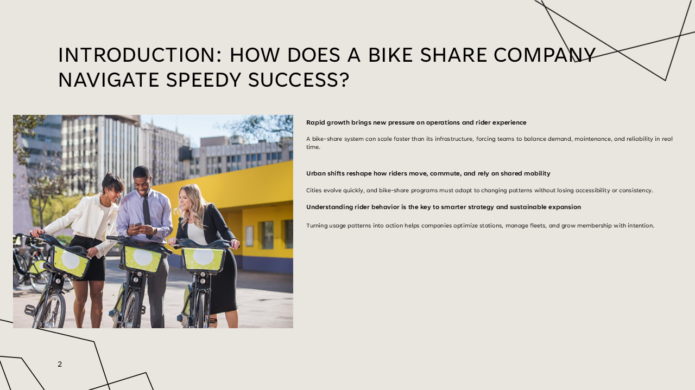

# Flow Charts & Visual Diagrams

This folder contains the visual elements used in the **Cyclistic Bike‑Share Case Study**, including:

- Intro Visual (Cyclistic Riders)
- Funnel Diagram
- Behavioral Flow Chart (PowerPoint)
- Supporting Visuals
- Notes & Insights

Each diagram helps illustrate the user journey, data‑cleaning logic, and analytical process behind the project.

---

## Intro Visual  
A human‑centered introduction to the Cyclistic experience, highlighting real riders and setting the tone for the analysis.

---

## Funnel Diagram  
This visual highlights the major stages of the Cyclistic user journey and where the largest drop‑offs occur.

---

## Behavioral Flow Chart (PowerPoint)  
This slide deck outlines the logical flow of user behavior, data processing, and decision points used in the analysis.

**Download:**  
[Behavioral Flow Chart – PowerPoint](./Bike%20Share%20Navigate%20Speedy%20Success.pptx)

---

## Notes & Insights  
Additional notes and observations will be added here to support the visuals and explain analytical decisions.

---
